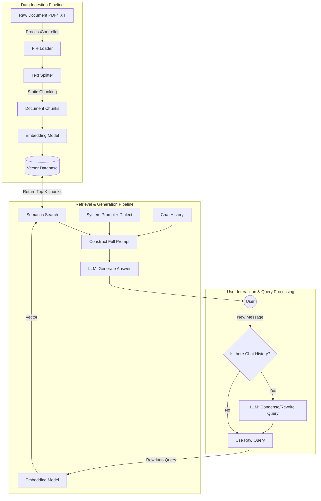

# Mini-RAG Architecture Analysis

This document provides a detailed breakdown of the Retrieval-Augmented Generation (RAG) architecture implemented in the `mini-rag-app` project.

## 1. RAG Paradigm Overview

In the current AI landscape, RAG architectures are generally classified into three paradigms:
1. **Naive RAG:** The standard "Retrieve-then-Read" framework. It involves basic chunking, embedding, vector search, and passing results directly to an LLM.
2. **Advanced RAG:** Introduces pre-retrieval and post-retrieval optimizations. This includes techniques like Query Rewriting, Hybrid Search, Re-ranking, and dynamic chunking to handle complex queries and context gaps.
3. **Modular RAG:** A highly customizable architecture that treats RAG components as interchangeable modules (e.g., adding a routing module, self-reflection, or web search fallback).

## 2. Our Implementation: Advanced Conversational RAG

Based on the codebase (`NLPController.py` and `ProcessController.py`), the `mini-rag-app` implements an **Advanced Conversational RAG**. 

It successfully moves beyond the Naive approach by implementing **Pre-retrieval Optimization (Query Rewriting)** and robust **State Management (Conversational Memory)**.

---

## 3. Core Architecture Breakdown

### A. The Baseline (Naive Features)
The foundation of the application handles the standard RAG pipeline efficiently:
*   **Document Ingestion:** Uses Langchain loaders (`TextLoader`, `PyMuPDFLoader`) in `ProcessController.py` to extract raw text.
*   **Static Chunking:** Implements a custom `process_simpler_splitter` to break documents into fixed sizes (default: 100) using a separator tag (e.g., `\n`).
*   **Vectorization & Storage:** Text chunks are embedded via `embedding_client` and stored in a vector database collection named dynamically by project ID.
*   **Semantic Search:** Performs a cosine similarity search (or equivalent vector distance metric) to retrieve the top `limit` relevant chunks.

### B. The Upgrade (Advanced Features)
The system's sophistication lies in how it handles user interactions during an ongoing chat:

#### 1. Query Rewriting (Condense Question)
**Location:** `NLPController.py -> answer_rag_question()`
This is the hallmark of your Advanced RAG setup.
*   **The Problem:** In a conversation, users use pronouns (e.g., "Tell me more about *it*"). A Vector DB cannot find relevant documents for the word "it".
*   **The Solution:** The system detects if `chat_history` exists. If yes, it intercepts the user's query and sends it to the LLM alongside the chat history using the `condense_question_prompt`. The LLM rewrites the query into a **standalone search term**. 
*   **Result:** The Vector DB is queried with the explicitly rewritten question, vastly improving retrieval accuracy for follow-up questions.

#### 2. Conversational Memory Injection
The system builds a comprehensive prompt that retains context:
*   It loads the customized `system_prompt` (including Arabic dialect instructions).
*   It appends the entire historical conversation (`base_chat_history`).
*   It injects the retrieved `documents_prompts`.
*   It wraps everything with the `footer_template`.
This ensures the LLM acts as an ongoing conversational agent rather than a stateless answering machine.

---

## 4. Architecture Diagram

---

## 5. Potential Future Enhancements

While the current architecture is robust and classified as Advanced RAG, here are logical next steps to push it toward a **Modular RAG** architecture:

1. **Post-Retrieval Re-ranking:** After retrieving the top 10 chunks, use a Cross-Encoder model (like `Cohere Rerank` or `BGE-Reranker`) to score and re-order the chunks based on exact relevance before sending them to the LLM.
2. **Hybrid Search:** Combine the current Semantic Search (Vector) with Keyword Search (BM25) to ensure exact name or ID matches aren't missed.
3. **Semantic Chunking:** Upgrade `process_simpler_splitter` to a semantic splitter that groups text by meaning/paragraphs rather than hard character limits, preventing sentences from being cut in half.
